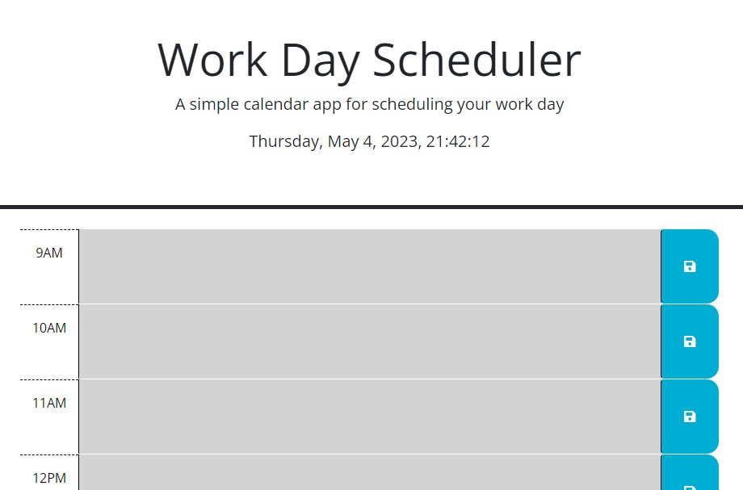

# work-day-scheduler

Name: Amy Kilgour

Please click [https://kilgette.github.io/work-day-scheduler/](https://kilgette.github.io/work-day-scheduler/) to view the live version.  

Objective: Create an hour-by-hour calender that can be updated with items assigned to the hour throughout the workday. The tasks are stored in local storage with the time blocks' colors reflecting past, present and future hour blocks depending on the current time. 

What I Learned: I learned how Day.js can be utilized as well as how to store 
complex data types in local storage. 